# Práctica de Ampliación

## Configuración de un servidor Nginx con Hosts Virtuales y directorios de usuario

Como para esta práctica se han reutilizado máquinas virtuales que ya estaban configuradas para este tipo de cosas, hay algunos pasos que no han sido detallados, pero aun así serán mencionados.

### Máquina Virtual con Debian

En mi caso ya tenía una configurada, así que simplemente la cloné para trabajar desde una nueva, indicando que generase nuevas IP y así no mezclarse con la otra.

### Conexión por SSH

Para conectarnos a nuestra máquina virtual por SSH, todo lo que tenemos que hacer es abrir la consola de comandos e introducir el siguiente comando, donde la IP debe corresponder a la de la máquina virtual, no la de la máquina anfitriona:

```
ssh <usuario>@192.168.137.31
```

Una vez conectados podemos manejarlo todo desde esa consola.

### Instalación de Nginx

En mi caso, Nginx ya estaba instalado, pero para comprobar que todo estaba bien, utilicé el siguiente comando para comprobar que funcionando:

```
systemctl status nginx
```
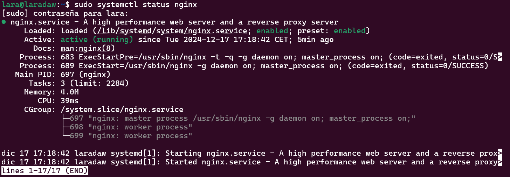

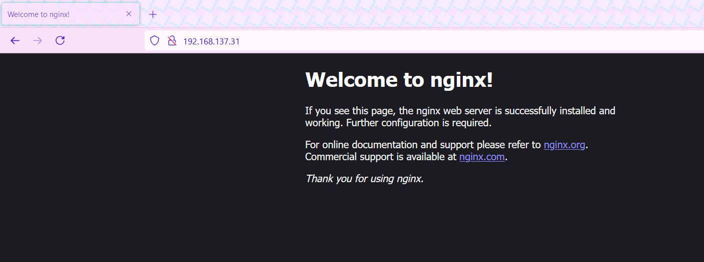

De todas formas, si hiciese falta instalar Nginx en sí, lo mejor y más rápido es instalarlo a través del gestor de paquetes con los siguientes comandos:

```
sudo apt-get update 
sudo apt-get upgrade 
sudo apt-get install nginx
```

No haría falta configurar nada más, ya que la configuración que viene por defecto debería ser suficiente para esta práctica.

### Creación de usuarios del sistema

Para la práctica vamos a crear dos usuarios diferentes de manera sencilla.

Haremos usuarios básicos, ya que no hace falta mucho más para esta actividad. Para ello, lo que sí vamos a tener en cuenta es que más adelante crearemos carpetas para cada usuario.

Para la creación del usuario, debemos utilizar los siguientes comandos:

```
sudo useradd -m -s /bin/bash <usuario>
sudo passwd <usuario>
```

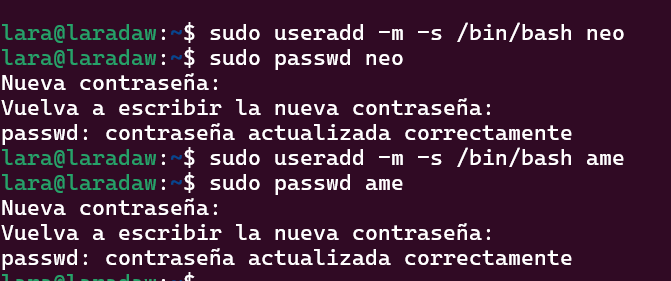

Obviamente, debemos usar los comandos dos veces para crear dos usuarios esta vez.

### Estructura de carpetas

Lo próximo sería crear una carpeta por usuario nuevo para que cada uno tenga su web. Como Nginx intenta acceder a `public_html` (que es como se llama por defecto la carpeta donde estará la página web), crearemos esta carpeta para cada usuario.

Para ello debemos seguir los siguientes pasos:

- Iniciamos sesión con el primer usuario y revisamos que estamos en su home.

```
su <usuario>
cd
```

- Creamos la carpeta de `public_html`.

```
mkdir public_html
```

- Para dar permisos a Nginx, utilizaremos un comando que nos deja darlos de manera más rápida:

```
setfacl -d -R -m u:www-data:rw public_html
```

Ten en cuenta que estos pasos se deben seguir DOS veces. Para configurarlo en los dos nuevos usuarios.

Y para comprobar que funciona y que se tienen los permisos necesarios, podemos comprobarlo con el siguiente comando:

```
getfacl <ruta_de_carpeta>
```

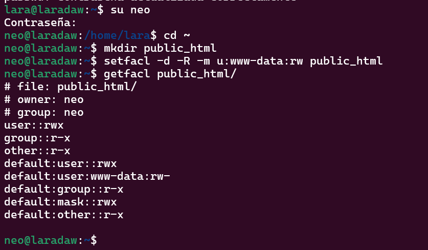

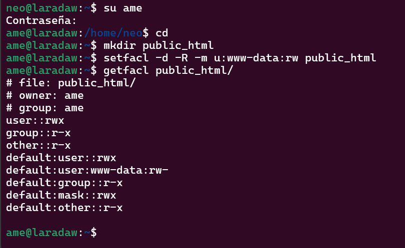

### Contenido web

Como lo único que crearemos serán páginas web sencillas para ver que funciona, vamos a crear un archivo `index.html` para cada usuario en la carpeta de `public_html`.

Para ello, debemos iniciar sesión con el usuario en sí, siguiendo los mismos comandos de antes, y una vez en la carpeta, utilizamos el comando `nano index.html` para crear el archivo en sí.

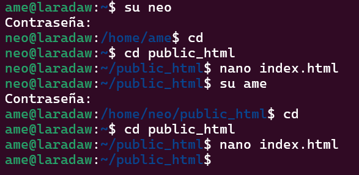

Podéis poner lo que queráis, pero la estructura básica a seguir es la siguiente:

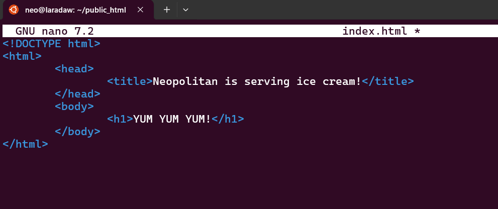

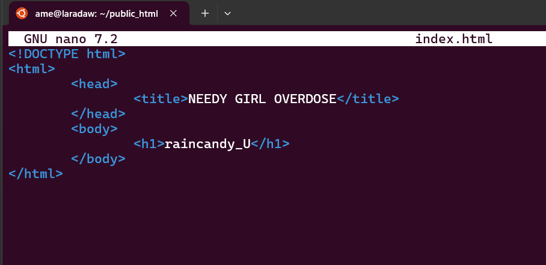

### Creación de los hosts virtuales

Crearemos unos archivos para que desde HTTP nos redirija a HTTPS.

Para ello, deberemos ir a la carpeta de sitios web disponibles en `/etc/nginx/sites-available/nombre_de_la_web` y entrar en una de ellas. Recordad que debemos seguir los pasos x2 al tener dos usuarios y dos webs diferentes.

Una vez dentro, utilizamos el comando `sudo nano <nombre>` para crear un archivo que tendrá la siguiente configuración:

```
# Este bloque es la configuración para el host en puerto 443
server {

    listen 443 ssl; 
    listen [::]:443 ssl;

    root <direccion_raiz_servidor>;

    ssl_certificate <direccion_certificado_tls-ssl>;
    ssl_certificate_key <direccion_clave_privada_certificado_tls-ssl>;

    index index.html;

    server_name <nombre_host>; 

    location / {
        return 301 https://$host:$request_uri; 
    }
}

# Este bloque hace referencia a la redirección
server {

    listen 80; 
    listen [::]:80;

    server_name <nombre_host>; 

    location / {
        return 301 https://$host:$request_uri; 
    }
}
```


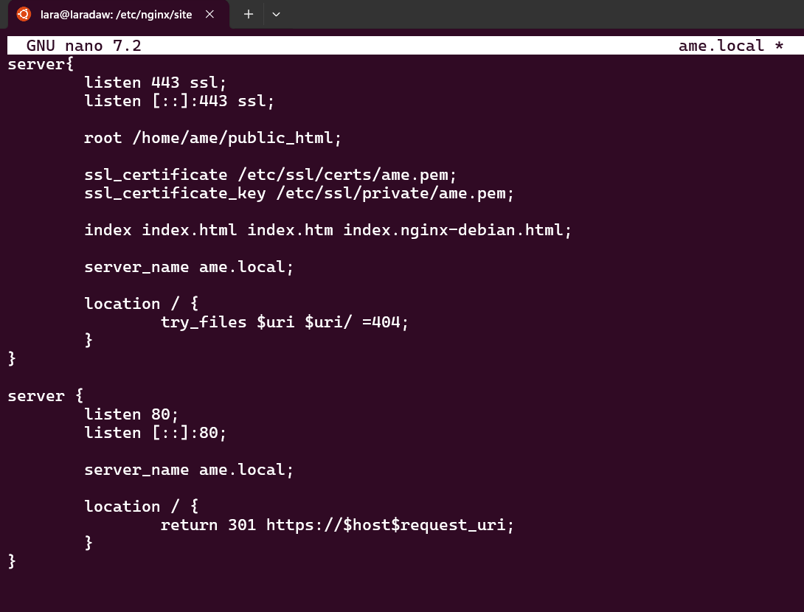

Una vez hecho eso, debemos crear los enlaces simbólicos para 'activar' las webs en `/etc/nginx/sites-enabled/`, las cuales también debemos repetir dos veces para las dos webs.

```
sudo ln -s /etc/nginx/sites-available/<archivo_de_configuración> /etc/nginx/sites-enabled
```

Y para comprobar que todo está correcto:

```
sudo nginx -t
```

Una vez comprobado que todo está bien, se reinicia Nginx:

```
sudo systemctl restart nginx
```

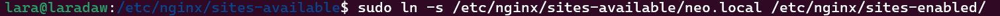

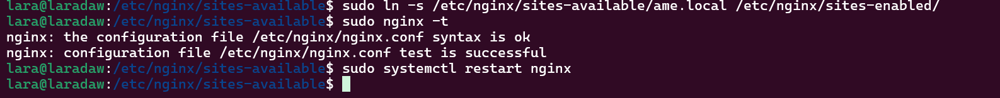

### Configurar el archivo hosts

Como en prácticas anteriores, debemos añadir los dominios e IPs de nuestros servidores para que se haga referencia a la máquina virtual.

Para ello, solo debemos abrir el archivo `hosts`, que en mi caso (Windows) se encuentra en `C:\Windows\System32\drivers\etc\hosts` y añadir la IP de la máquina virtual y los nombres de los dominios.


### Generación de certificados para HTTPS

Para que la web sirva con HTTPS, necesitamos certificados, pero como esto es una práctica y no una web real, generaremos un certificado para cada usuario que hemos creado.

Yo ya tenía algún certificado de antes, pero por si acaso, generé uno por usuario para no pillarme los dedos.

Podemos hacerlo con el siguiente comando, generándolos en el directorio `/etc/ssl/certs` y la clave correspondiente en `/etc/ssl/private`:

```
openssl req -x509 -newkey rsa:4096 -keyout <private_key_file> -out <certificate_file> -sha256 -days 365 --nodes
```

Debería quedar algo así:

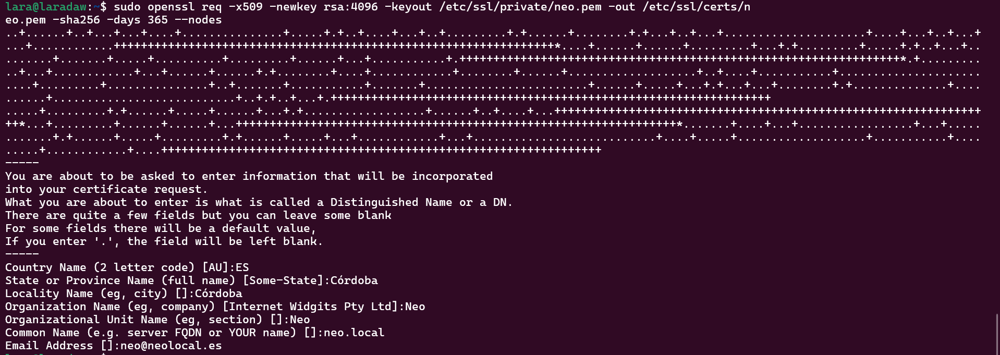

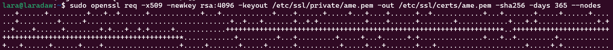

### Comprobación final

Una vez hecho todo lo anterior, deberíamos poder acceder a los dominios y ser redirigidos a su versión HTTPS, al igual que cada web debería mostrar su propio certificado:

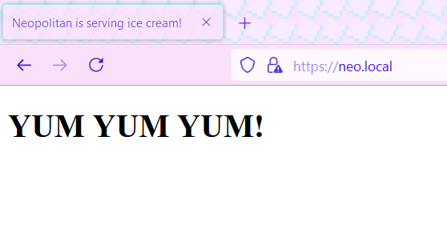

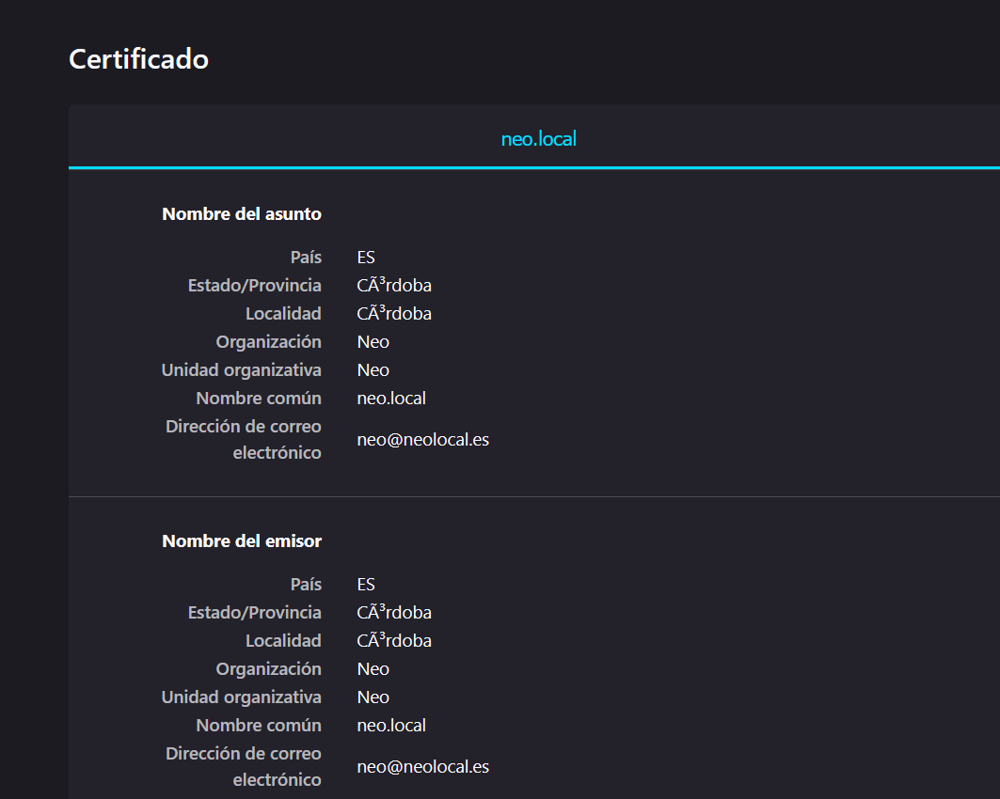

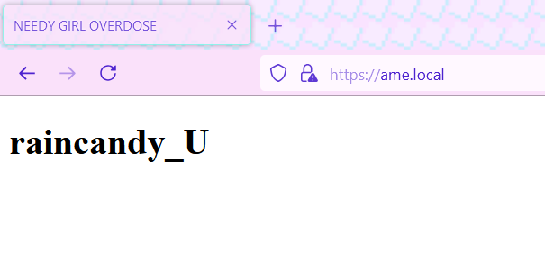

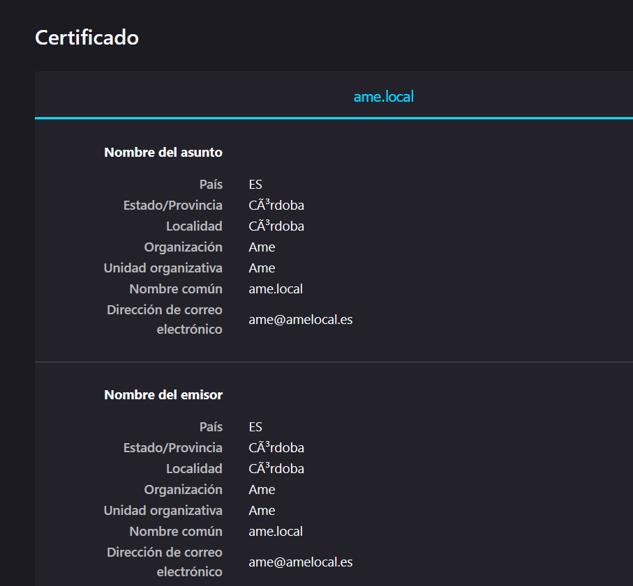

